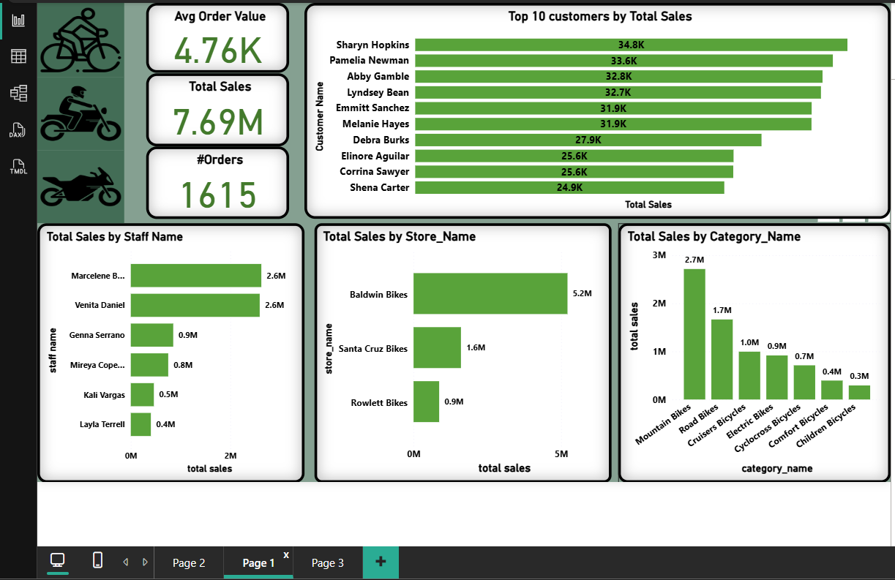
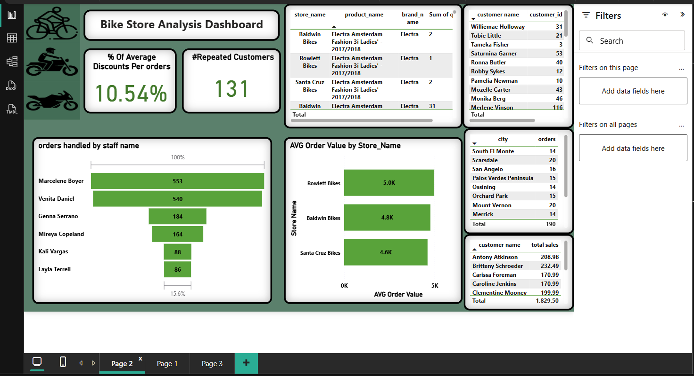
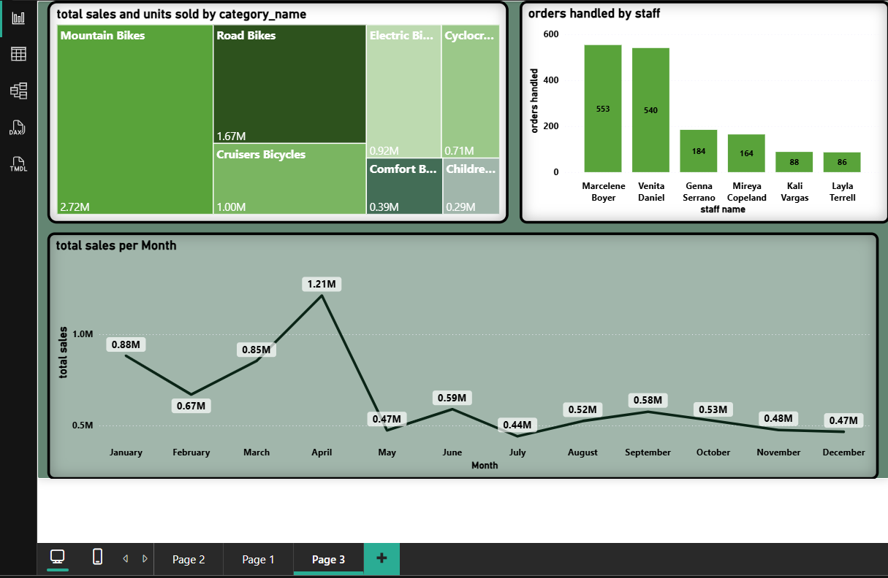

# 🚴‍♂️ BikeStores — Sales Analytics (SQL + Power BI)

Comprehensive analysis and dashboarding project for the BikeStores sample dataset. Includes SQL extracts, a star-schema data model, DAX measures, and a Power BI report. This repository demonstrates an end-to-end analytics workflow: restore the database, run SQL extracts, model data and create visuals in Power BI.

## Table of contents

- [Project overview](#project-overview)
- [Dataset & schema](#dataset--schema)
- [Prerequisites](#prerequisites)
- [Restore the database (SQL Server)](#restore-the-database-sql-server)
- [Quick start — Power BI connection](#quick-start--power-bi-connection)
- [Data model](#data-model)
- [Key SQL queries](#key-sql-queries)
- [DAX measures (Power BI)](#dax-measures-power-bi)
- [Dashboard pages & visuals](#dashboard-pages--visuals)
- [Repository files](#repository-files)
- [Contributing](#contributing)
- [License & contact](#license--contact)

---

## Project overview

This project extracts, models, and visualizes sales data from the BikeStores sample database. The goal is to provide meaningful KPIs and interactive dashboards for stakeholders to monitor sales, staff performance, product categories, inventory, and customers.

Core deliverables:

- SQL queries to compute KPIs and aggregations
- Star-schema design with `order_items` as the fact table and dimensions for products, customers, stores, staff, categories, brands and date
- A Power BI report (`BikeStores_Analytics.pbix`) with DAX measures and multiple dashboard pages

---

## Dataset & schema

The original dataset is provided as a SQL Server backup: `BikeStores.bak`.

Important schemas and tables used:

- sales.customers
- sales.orders
- sales.order_items (fact)
- sales.staffs
- sales.stores
- production.products
- production.categories
- production.brands
- production.stocks

---

## Prerequisites

- Microsoft SQL Server (Express / Developer / Standard) with SQL Server Management Studio (SSMS) or equivalent tools
- Power BI Desktop (latest stable release recommended)
- Access to the `BikeStores.bak` file included in this repository (or your own copy)

Optional:

- Power BI Service for sharing and scheduled refresh

---

## Restore the database (SQL Server)

Restore steps (SSMS GUI):

1. Open SQL Server Management Studio and connect to your server instance.
2. Right-click `Databases` -> `Restore Database...`.
3. Choose `Device` -> Add the `BikeStores.bak` file from the repository location.
4. Choose a target database name (for example `BikeStores`) and click `OK` to restore.

Restore using T-SQL (adjust file paths / logical names as needed):

```sql
-- Example: restore BikeStores from a backup file
RESTORE DATABASE BikeStores
FROM DISK = N'C:\path\to\BikeStores.bak'
WITH REPLACE,
		 MOVE 'BikeStores_Data' TO 'C:\path\to\MSSQL\DATA\BikeStores.mdf',
		 MOVE 'BikeStores_Log'  TO 'C:\path\to\MSSQL\DATA\BikeStores_log.ldf';
```

If you see logical file names mismatch errors, run:

```sql
RESTORE FILELISTONLY FROM DISK = N'C:\path\to\BikeStores.bak';
```

That returns the logical file names you should use in the `MOVE` clauses.

---

## Quick start — Power BI connection

1. Open Power BI Desktop.
2. Click `Get Data` → `SQL Server`.
3. Enter the SQL Server instance name and database (`BikeStores`).
4. Choose the appropriate authentication mode and connect.
5. Import or DirectQuery depending on dataset size and refresh needs.

Tip: Use `sales.order_items` as the central fact table and import the related dimension tables to build a star schema in the Power BI Model view.

---

## Data model

The model used in this project is a star schema with `sales.order_items` as the fact table and the following dimensions: `customers`, `staffs`, `stores`, `products`, `categories`, `brands`, and `Date`. 


You can find a model diagram screenshot in the repository (`Data Modeling  bike.png`) referenced from the Power BI model view.

---

## Key SQL queries

All queries are also included in the file `Quereis Bike store.sql` in this repository. Below are the most commonly used extracts.

1) Total sales per month

```sql
SELECT
	YEAR(o.order_date) AS order_year,
	MONTH(o.order_date) AS order_month,
	SUM(oi.quantity * oi.list_price * (1 - oi.discount)) AS total_sales
FROM sales.orders o
JOIN sales.order_items oi ON o.order_id = oi.order_id
GROUP BY YEAR(o.order_date), MONTH(o.order_date)
ORDER BY order_year, order_month;
```

2) Total sales by store

```sql
SELECT
	s.store_name,
	SUM(oi.quantity * oi.list_price * (1 - oi.discount)) AS total_sales
FROM sales.stores s
JOIN sales.orders o ON s.store_id = o.store_id
JOIN sales.order_items oi ON o.order_id = oi.order_id
GROUP BY s.store_name
ORDER BY total_sales DESC;
```

3) Total sales by product category

```sql
SELECT
	c.category_name,
	SUM(oi.quantity) AS total_units_sold,
	SUM(oi.quantity * oi.list_price * (1 - oi.discount)) AS total_sales
FROM production.categories c
JOIN production.products p ON c.category_id = p.category_id
JOIN sales.order_items oi ON p.product_id = oi.product_id
GROUP BY c.category_name
ORDER BY total_sales DESC;
```

4) Top 10 customers by total sales

```sql
SELECT TOP 10
	c.first_name + ' ' + c.last_name AS customer_name,
	SUM(oi.quantity * oi.list_price * (1 - oi.discount)) AS total_sales
FROM sales.customers c
JOIN sales.orders o ON c.customer_id = o.customer_id
JOIN sales.order_items oi ON o.order_id = oi.order_id
GROUP BY c.first_name, c.last_name
ORDER BY total_sales DESC;
```

5) Average order value per store

```sql
SELECT
	s.store_name,
	SUM(oi.quantity * oi.list_price * (1 - oi.discount)) /
	COUNT(DISTINCT o.order_id) AS avg_order_value
FROM sales.stores s
JOIN sales.orders o ON s.store_id = o.store_id
JOIN sales.order_items oi ON o.order_id = oi.order_id
GROUP BY s.store_name
ORDER BY avg_order_value DESC;
```

6) Repeat customers (2+ orders)

```sql
SELECT TOP 30
	c.customer_id,
	c.first_name + ' ' + c.last_name AS customer_name,
	COUNT(o.order_id) AS orders_count
FROM sales.customers c
JOIN sales.orders o ON c.customer_id = o.customer_id
GROUP BY c.customer_id, c.first_name, c.last_name
HAVING COUNT(o.order_id) >= 2
ORDER BY orders_count DESC;
```

7) Average discount applied per order

```sql
SELECT AVG(discount) AS avg_discount_per_order
FROM sales.order_items;
```

8) Staff activity — number of orders handled

```sql
SELECT
	st.first_name + ' ' + st.last_name AS staff_name,
	COUNT(o.order_id) AS orders_handled
FROM sales.staffs st
JOIN sales.orders o ON st.staff_id = o.staff_id
GROUP BY st.first_name, st.last_name
ORDER BY orders_handled DESC;
```

For full query collection, see `Quereis Bike store.sql` in the repository root.

---

## DAX measures (Power BI)

The report uses a small set of DAX measures to compute KPIs. Example formulas:

| Measure | DAX formula | Description |
|---|---|---|
| Total Sales | `SUMX('sales order_items', [quantity] * [list_price] * (1 - [discount]))` | Calculates revenue from order items |
| Orders | `DISTINCTCOUNT('sales orders'[order_id])` | Number of unique orders |
| Units Sold | `SUM('sales order_items'[quantity])` | Total quantity sold |
| Average Order Value (AOV) | `[Total Sales] / [Orders]` | Average revenue per order |
| Repeat Customers | `CALCULATE(DISTINCTCOUNT('sales customers'[customer_id]), FILTER('sales customers', [Orders] > 1))` | Customers with >1 order |
| Average Discount | `AVERAGE('sales order_items'[discount])` | Mean discount rate |

Tips:

- Use summarized measures (SUMX) rather than row-by-row computations in visuals where applicable.
- Create a Date table and mark it as a Date table in Power BI for time intelligence functions.

---

## Dashboard pages & visuals

The Power BI file `BikeStores_Analytics.pbix` contains three main pages:

- Page 1 — Sales overview: KPIs, top customers, sales by staff/store/category
- Page 2 — Customer & staff performance: average discount, repeat customers, staff order handling
- Page 3 — Monthly & category analysis: time series of total sales and category-level breakdown

Visuals include KPI cards, bar charts, tree maps, line charts, and detail tables. See the included screenshots for examples.

### Screenshots

#### Page 1 — Sales overview


#### Page 2 — Customer & staff performance


#### Page 3 — Monthly & category analysis



