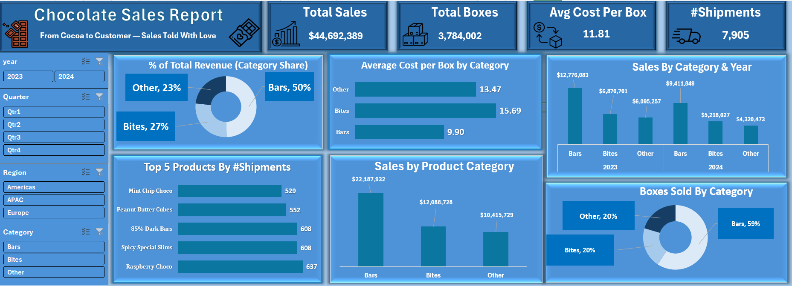
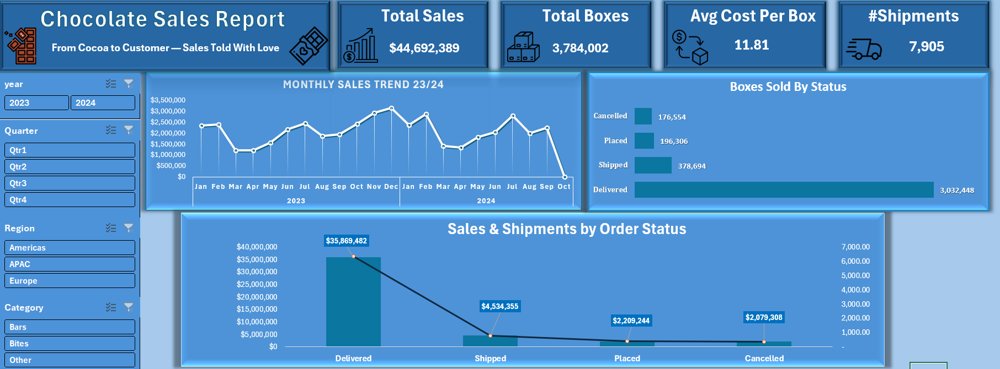
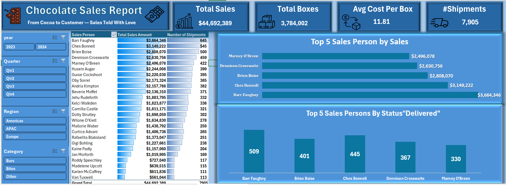
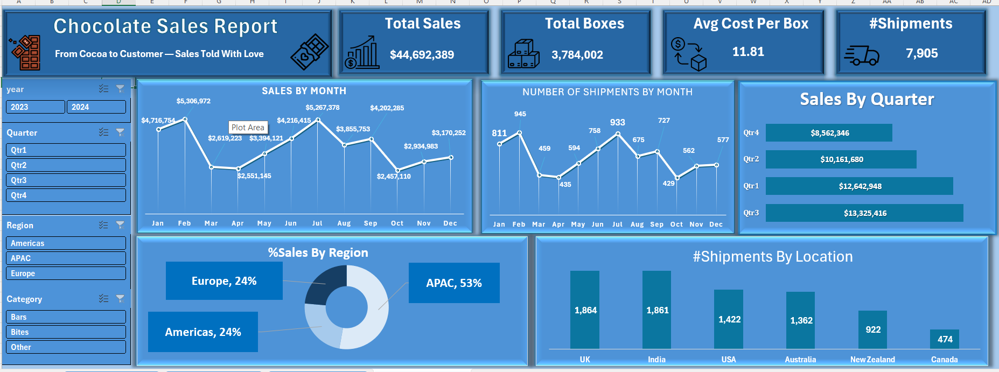

 

# 📊 Chocolate Sales — Sales & Shipments Dashboard (Excel)

Comprehensive sales and shipments reporting workbook for a chocolate business. The workbook uses Excel tables, Power Query transformations, and the Data Model (Power Pivot) to deliver interactive dashboards, KPIs, and analytical views across time, categories, products, and sales teams.

## Table of contents

- [Project overview](#project-overview)
- [Dataset & schema](#dataset--schema)
- [Data model](#data-model)
- [Data preparation & cleaning](#data-preparation--cleaning)
- [Data validation snapshot](#data-validation-snapshot)
- [DAX measures (Power Pivot)](#dax-measures-power-pivot)
- [Dashboard pages & visuals](#dashboard-pages--visuals)
- [Key business insights](#key-business-insights)
- [Business recommendations](#business-recommendations)
- [Repository files](#repository-files)

---

## Project overview

This workbook analyzes chocolate sales and shipment performance across regions, product categories, salespersons, and time. It provides stakeholders with KPIs, trend analysis, category/product breakdowns, and operational metrics to support merchandising, logistics, and sales planning.

Core deliverables:

- Refreshable Excel workbook with dashboards and underlying data model
- Time-series analysis of sales and shipment counts
- Category & product performance summaries
- Top-products and top-salesperson leaderboards
- Data model with calendar and lookup tables for flexible analysis

Main KPIs shown in the dashboard:

| KPI | Value (example) |
|---|---:|
| Total Sales | `$44,692,389` |
| Total Boxes | `3,784,002` |
| Avg Cost per Box | `11.81` |
| #Shipments | `7,905` |

---

## Dataset & schema

The workbook uses several tables loaded into the Data Model.

| File / Table | Role | Description |
|---|---|---|
| `shipments` | Fact table | Shipment records containing amounts, boxes, dates, product and location keys |
| `products` | Dimension table | Product list with category and cost per box |
| `people` | Dimension table | Sales person metadata (names, teams, SPID) |
| `calendar` | Date dimension | Dates, months, years, and weekday attributes |

Important fields (examples):

### `shipments`

- `ShipmentID`
- `SPID` (sales person id)
- `PID` (product id)
- `GID` (location id)
- `Shipdate`
- `Amount`
- `Boxes`
- `Order_Status`

### `products`

- `PID`
# 📊 Chocolate Sales — Sales & Shipments Performance Analysis (Excel)

This repository contains an Excel-based BI dashboard project for chocolate sales and shipments. The solution is built with Excel, Power Query, Power Pivot / Data Model, DAX measures, Pivot Tables, and interactive dashboards to analyze performance across products, categories, salespeople, regions, and time.

---

## Project overview

This project analyzes chocolate sales and shipment performance across products, categories, salespeople, regions, and time. It provides stakeholders with KPI monitoring, trend analysis, product and category breakdowns, and operational metrics to support merchandising, logistics, and sales strategy.

Core deliverables:

- Excel workbook with interactive dashboards and Data Model
- Time-series analysis and monthly/quarterly trends
- Category and product performance summaries
- Salesperson leaderboards and shipment analytics

Main KPIs (example snapshot):

| KPI | Value |
|---|---:|
| Total Sales | `$44,692,389` |
| Total Boxes Sold | `3,784,002` |
| Average Revenue per Box | `$11.81` |
| Total Shipments | `7,905` |

---

## Dataset & schema

The workbook uses the following tables loaded into the Data Model.

| Table | Role | Description |
|---|---|---|
| `shipments` | Fact table | Shipment-level transactions with amounts, box counts, product, person, and location keys |
| `products` | Dimension | Product master with category and cost metadata |
| `people` | Dimension | Sales person master (names, teams, SPID) |
| `calendar` | Date dimension | Date attributes used for time intelligence (Month, Quarter, Year, Weekday) |

Important fields by table:

### `shipments`

- `ShipmentID`
- `ShipDate`
- `Amount`
- `Boxes`
- `SPID` (sales person id)
- `PID` (product id)
- `GID` (location id)
- `Order_Status`

### `products`

- `PID`
- `Product`
- `Category`
- `Cost_per_Box`

### `people`

- `SPID`
- `Sales_Person`
- `Team`

### `calendar`

- `Date`
- `Month`
- `Quarter`
- `Year`
- `Weekday`

---

## Data model

The workbook follows a star-schema design with `shipments` as the central fact table connected to lookup/dimension tables (`products`, `people`, `calendar`).

- `shipments` (fact) → connects to `products` on `PID` (1-to-many)
- `shipments` (fact) → connects to `people` on `SPID` (1-to-many)
- `shipments` (fact) → connects to `calendar` on `ShipDate`/`Date` (1-to-many)

These relationships support slicers, cascading filters, and measure calculations across dashboards.

---

## Data preparation & cleaning

Typical ETL steps performed in Power Query and during model preparation:

1. Import source tables (CSV or in-workbook tables).
2. Verify and set correct data types for dates, numbers, and keys.
3. Standardize and normalize column names (e.g., `ShipDate`, `ShipmentID`).
4. Trim and clean text fields; correct common typos.
5. Remove duplicates or outlier rows where appropriate.
6. Create a robust `calendar` table with Year, Quarter, Month, and Weekday attributes.
7. Load cleaned tables into the Data Model (Power Pivot).
8. Create relationships between `shipments` and lookup tables.
9. Build DAX measures and Pivot Tables used by dashboard visuals.

---

## Data validation snapshot

Validation metrics from the source data (snapshot):

| Metric | Value |
|---|---:|
| Total Sales | `$44,692,389` |
| Total Boxes Sold | `3,784,002` |
| Total Shipments | `7,905` |

Top regions by sales (snapshot):

| Region | Sales |
|---|---:|
| APAC | `$22,190,000` |
| Europe | `$12,088,728` |
| Americas | `$10,413,661` |

Note: Values above are taken from a validation snapshot embedded in the workbook and may update after refresh.

---

## DAX measures (Power Pivot)

Key measures used across the dashboard (examples):

| Measure | Formula |
|---|---|
| Total Sales | `SUM(shipments[Amount])` |
| Total Boxes | `SUM(shipments[Boxes])` |
| Total Shipments | `DISTINCTCOUNT(shipments[ShipmentID])` |
| Avg Revenue per Box | `DIVIDE([Total Sales], [Total Boxes])` |

Example DAX definitions:

```DAX
Total Sales = SUM(shipments[Amount])
```

```DAX
Total Boxes = SUM(shipments[Boxes])
```

```DAX
Total Shipments = DISTINCTCOUNT(shipments[ShipmentID])
```

```DAX
Avg Revenue per Box = DIVIDE([Total Sales], [Total Boxes])
```

---

## Dashboard pages & visuals

Page 1 — Sales Overview

- Main visuals: KPI tiles (Total Sales, Total Boxes, Avg Revenue/Box, Shipments), Monthly Sales Trend (line), Shipments by Status (bar), Top regions (treemap).
- Key observations: Monthly seasonality, strong APAC contribution, delivered shipments dominate total boxes.

Overview screenshot and insight:



- Insight: Monthly sales show a clear seasonality with peaks in mid-year and year-end; delivered shipments account for the majority of boxes, indicating strong fulfillment rates.

Page 2 — Product Performance

- Main visuals: Revenue by Category (bar), Boxes Sold by Category (donut), Top 10 Products by Shipments (bar), Average Cost per Box (bar).
- Key observations: A small set of products drive most revenue and boxes; category-level margins vary.

Product performance screenshot and insight:


- Insight: Bars category contributes the largest share of revenue and boxes; consider inventory prioritization and margin analysis on 'Bites' and 'Other' categories.

Page 3 — Salesperson Performance

- Main visuals: Top Salespersons by Revenue (bar), Top Salespersons by Delivered Shipments (bar), Sales by Team (table).
- Key observations: A handful of salespeople contribute disproportionate revenue and shipments; identify and replicate their practices.

Salesperson performance screenshot and insight:



- Insight: The top 5 salespeople account for a large share of revenue — prioritize retention and capture their playbook for scaling.

Each page includes slicers for Year, Quarter, Region, and Category to enable ad-hoc analysis.

Page 4 — Region Analysis



---

## Key business insights

- APAC is the largest revenue region in the snapshot and should be prioritized for growth investments.
- A small number of top products account for a significant share of revenue and boxes sold.
- Shipment volume is strong but concentrated; optimizing logistics for top routes can reduce cost and lead times.
- Top salespeople generate a large proportion of revenue — codify their approaches and coaching opportunities.
- Revenue is concentrated among key SKUs; consider assortment optimization and inventory allocation.

---

## Business recommendations

- Allocate inventory and promotional budget to the highest-selling products to reduce stockouts and increase revenue.
- Expand targeted marketing and reseller partnerships in APAC to capture additional market share.
- Implement cross-sell promotions for complementary products to increase basket value.
- Document top salesperson strategies and run peer-led training sessions to scale best practices.
- Improve forecasting by adding time-series forecast visuals and rolling-window accuracy tracking.
- Add margin and profit analysis to shift focus from revenue to profitability in future iterations.

---

## Repository files

| File | Description |
|---|---|
| `Chocolate Sales.xlsx` | Main Excel dashboard workbook with data model and dashboard sheets |
| `ReadMe.md` | Project documentation (this file) |
| `Dashboard Screenshots` | Folder or sheet containing dashboard visuals and portfolio images |

---

This README is designed for GitHub and portfolio use. For additional deliverables — data dictionary, exported PDF snapshots, or example CSVs to drive the queries — tell me which you'd like next and I will add them.


