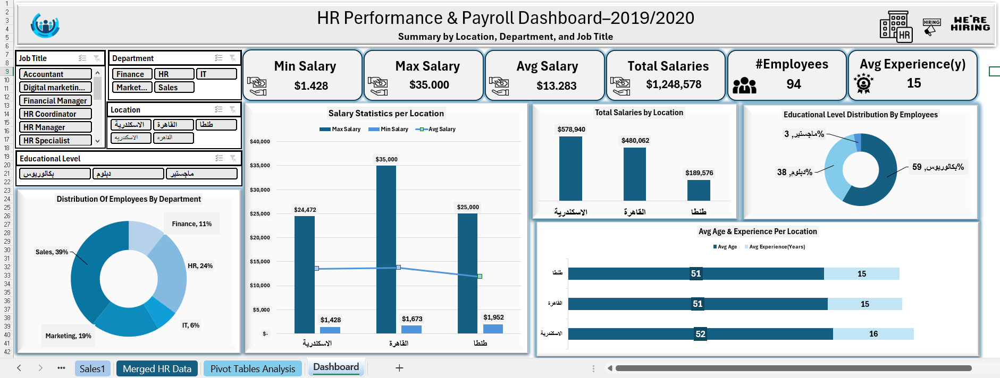
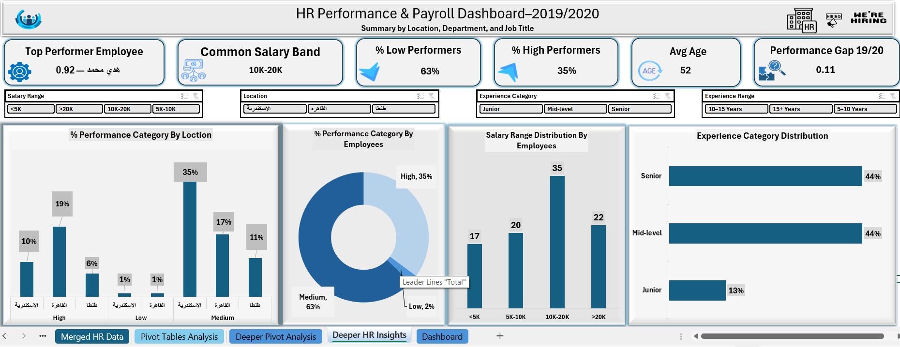
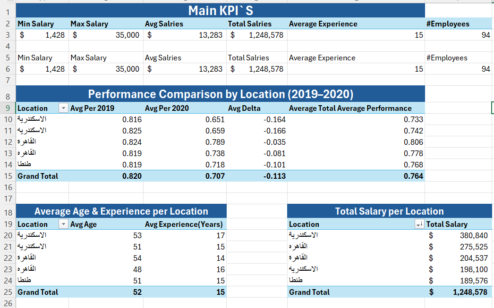
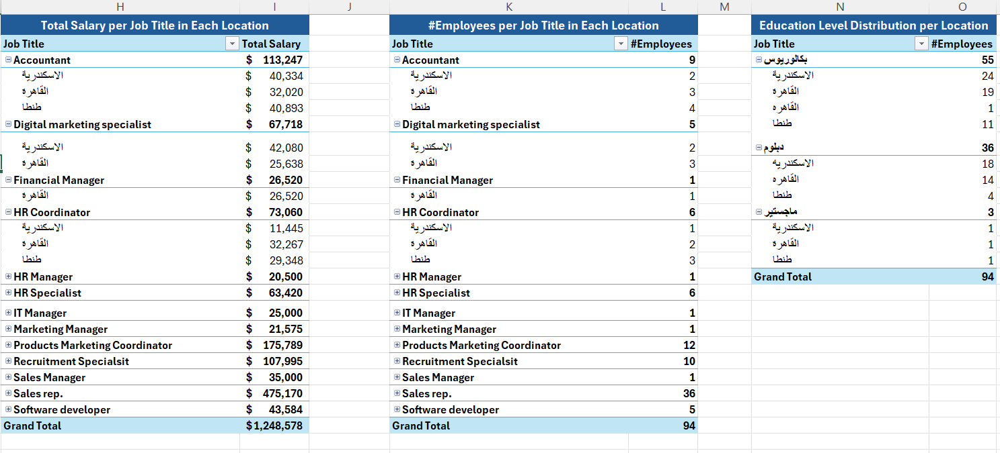
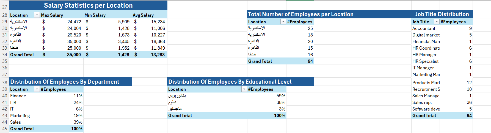
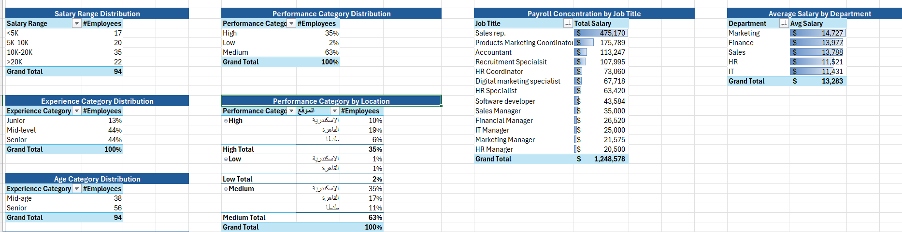

# HR Performance & Payroll Analytics Dashboard  
### End-to-End Excel Data Cleaning, Transformation, Analysis & Dashboarding

This project provides a complete analytical view of an organization's **workforce, payroll, and performance** using advanced Excel techniques including **Power Query**, **Pivot Tables**, **KPI Cards**, and **Interactive Dashboards**.

The entire workflow converts scattered HR data from multiple sheets into **clean, unified, and actionable insights** for HR managers and business leaders.

---

## 📌 0. Business Case / Problem

The HR department stored employee data across **five separate sheets** (Sales, HR, IT, Finance, Marketing).  
There was **no single version of truth** to answer key HR questions:

- Who are the **top and low performers**?
- What is the **most common salary band**?
- Which **locations perform best**?
- How is **payroll distributed** across job titles and departments?
- What is the **experience structure** of the workforce?
- How do performance metrics **change year-over-year (2019–2020)?**

This project solves the problem by creating a **clean unified HR dataset** and building two professional dashboards for decision support.

---

# 🔧 1. Power Query — Data Cleaning & Transformation

All HR sheets were imported and transformed using Excel Power Query.

### ✔ Cleaning Steps  
- Removed duplicates from all sheets  
- Standardized column names  
- Corrected data types (dates, text, numbers)  
- Fixed inconsistent location names (e.g., الإسكندرية ← الإسكندرية)  
- Ensured salary, PER2019, PER2020 were numeric  

### ✔ Transformations  
Several new calculated columns were added:

| New Column | Purpose |
|-----------|---------|
| **Age** | Calculated from Date of Birth |
| **Experience (Years)** | Years since Hire Date |
| **Salary Range** | <5K, 5K–10K, 10K–20K, >20K |
| **Experience Range** | 5–10, 10–15, 15+ |
| **Experience Category** | Junior, Mid-level, Senior |
| **Age Category** | Young, Mid-age, Senior |
| **Delta Performance** | PER2020 – PER2019 |
| **Performance Category** | High, Medium, Low |

### ✔ Append Queries  
All sheets were appended into **one unified HR dataset** containing:

- 94 employees  
- 15+ cleaned and engineered columns  
- Fully structured data model ready for dashboards  

---

# 📊 2. Pivot Analysis — Analytical Backbone

A dedicated sheet was built to analyze HR metrics using 15+ PivotTables.

### 📌 Key Pivot Analyses
- **Salary Statistics by Location** (Max, Min, Avg)  
- **Performance Comparison (2019 → 2020)**  
- **Performance Category Distribution (High, Medium, Low)**  
- **Salary Distribution by Range**  
- **Total Salary by Job Title**  
- **Employee Count per Job Title**  
- **Experience Category Distribution**  
- **Age Category Distribution**  
- **Payroll Concentration per Role**  
- **Average Salary by Department**  
- **Average Age & Experience by Location**  

These pivot tables fuel both dashboards.

---

# 📈 3. Dashboard 1 — HR Performance & Payroll Overview

A fully interactive dashboard presenting high-level KPIs and workforce insights.

### ⭐ KPI Cards:
- **Top Performer Employee** (dynamic with slicers)
- **Common Salary Band**
- **% Low Performers**
- **% High Performers**
- **Avg Employee Age**
- **Performance Gap (2019–2020)**
- **Total Salaries**
- **#Employees**

### ⭐ Slicers:
- Job Title  
- Department  
- Location  
- Salary Range  
- Educational Level  

### ⭐ Visuals:
- Salary Statistics by Location  
- Total Salaries by Location  
- Employees by Department  
- Educational Level Distribution  
- Average Age & Experience by Location  

> This dashboard provides a complete performance, payroll, and workforce overview.

---

# 🟩 4. Dashboard 2 — Deeper HR Insights

Focuses on experience, salary segmentation, and performance structure.

### ⭐ KPI Cards:
- Common Salary Band  
- % Low Performers  
- % High Performers  
- Avg Age  
- Performance Gap 19/20  
- Top Performer (Name + Score)

### ⭐ Visuals:
- **Performance Category by Location**
- **Performance Distribution (High/Medium/Low)**
- **Salary Range Distribution**
- **Experience Category Distribution**
- **Age Category Distribution**
- **Payroll Concentration by Job Title**
- **Average Salary by Department**

> This dashboard provides deeper analytical insights for HR strategy.

---

# 📉 Key Insights

- **10K–20K** is the most common salary band.  
- **35%** of employees are high performers; **63%** are low performers.  
- Cairo & Alexandria show the strongest performance.  
- **Mid-level and Senior employees** form 88% of the workforce.  
- Payroll is concentrated in **Sales**, **Marketing**, and **Recruitment roles**.  
- Average employee age = **52 years**.  
- Performance improved in certain locations but dropped overall.  

---

# 🛠 Tools & Skills Used

- Microsoft Excel  
- Power Query (ETL)  
- Pivot Tables  
- Pivot Charts  
- Dashboard Design
- HR Analytics  
- Data Modeling  
- KPI & Metric Engineering  
- Data Cleaning & Validation  

---
### 📊 Pivot Analysis Samples

