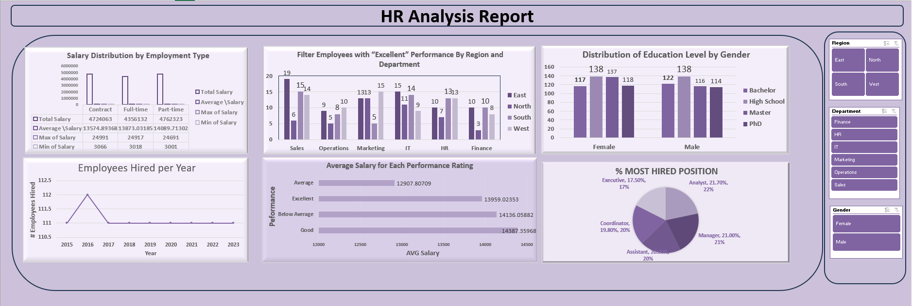
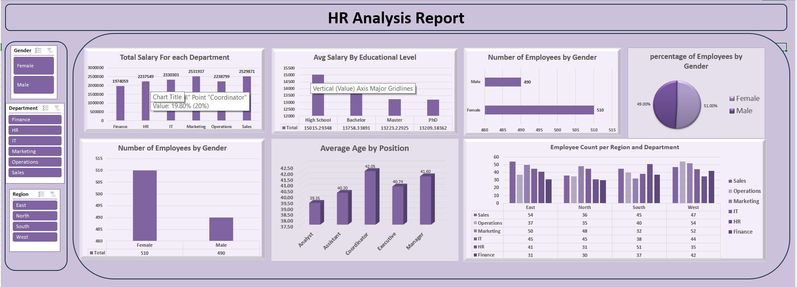
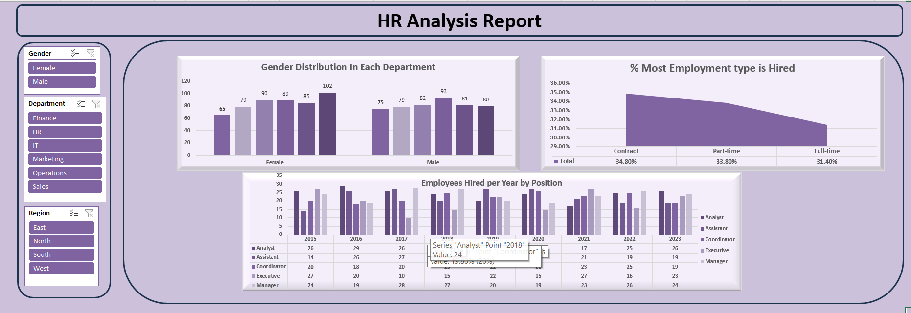

# 👩‍💼 HR Analysis Report (Excel Project)

**Comprehensive Workforce Insights Using Pivot Tables and Excel Dashboards**

---

## 📘 Project Overview
This project presents a detailed **Human Resources (HR) Analysis Report** built entirely in **Microsoft Excel** using **Pivot Tables, Pivot Charts, and interactive slicers**.  

The dashboard visualizes key workforce and salary metrics across multiple dimensions such as **department, gender, region, education level, position, employment type, and performance rating**.  

It answers major HR business questions including:
- Salary distribution by department and employment type  
- Hiring trends by year and position  
- Gender and education balance across the organization  
- Age distribution and average salary by role  
- Employee count by department, region, and performance level  

---

## 📂 Dataset Information

**File:** `HR_Data.xlsx`  
**Total Records:** 1000 employees  
**Time Span:** 2015 – 2023  

| Column | Description |
|---------|-------------|
| **Employee ID** | Unique identifier for each employee |
| **Gender** | Male / Female |
| **Age** | Employee age |
| **Position** | Job role (Analyst, Assistant, Coordinator, Executive, Manager) |
| **Department** | HR, IT, Finance, Sales, Operations, Marketing |
| **Region** | East, North, South, West |
| **Education Level** | High School, Bachelor, Master, PhD |
| **Employment Type** | Full-time, Part-time, Contract |
| **Performance Rating** | Excellent, Good, Average, Below Average |
| **Hire Year** | Year employee was hired |
| **Salary** | Annual total salary in SAR |

---

## 🧮 Data Preparation
The dataset was cleaned and prepared within Excel using:
- **Removing duplicates and blanks** in Employee ID and Department columns  
- **Converting the range to a Table** for dynamic Pivot Table references (`Ctrl + T`)  
- **Data validation** for fields such as gender and department  
- Ensuring **consistent formatting** of numeric and date fields  

---

## 🧱 Pivot Table Structure

All key metrics were generated through individual Pivot Tables, grouped logically as follows:

### 1️⃣ Payroll & Salary Insights
- **Total Salary by Department**  
- **Average Salary by Educational Level**  
- **Salary Distribution by Employment Type**  
- **Salary Distribution by Gender**  
- **Average Salary for Each Performance Rating**

### 2️⃣ Employee Demographics
- **Number of Employees by Gender**  
- **Average Age by Position**  
- **Distribution of Education Level by Gender**  
- **Gender Distribution in Each Department**  

### 3️⃣ Workforce Composition
- **Employee Count per Region and Department**  
- **% Most Hired Positions**  
- **% Most Common Employment Type**  
- **Employees Hired per Year**  
- **Employees Hired per Year and Position**  
- **Employees with “Excellent” Performance by Region and Department**

---

## 📊 Dashboard Overview

All dashboards are created with **Pivot Charts** linked to multiple **slicers** (Gender, Department, and Region), enabling dynamic cross-filtering.

---

## 🧩 Key Pivot Table Outputs

### 💰 Total Salary by Department
| Department | Total Salary (SAR) |
|-------------|-------------------|
| Finance | 1,974,059 |
| HR | 2,237,549 |
| IT | 2,330,303 |
| Marketing | 2,531,937 |
| Operations | 2,238,799 |
| Sales | 2,529,871 |
| **Grand Total** | **13,842,518** |

> **Sales and Marketing** have the highest payroll costs; **Finance** has the lowest.

---

### 🎓 Average Salary by Education Level
| Education Level | Avg Salary (SAR) |
|-----------------|------------------|
| High School | 15,015 |
| Bachelor | 13,758 |
| Master | 13,223 |
| PhD | 13,209 |
| **Grand Total** | **13,842** |

> Employees with **High School education** surprisingly earn the highest average salary.

---

### 👩‍💻 Employees by Gender
| Gender | Count | Percentage |
|---------|--------|------------|
| Female | 510 | 51% |
| Male | 490 | 49% |

> Workforce is almost perfectly balanced between male and female employees.

---

### 👨‍🏫 Average Age by Position
| Position | Avg Age |
|-----------|----------|
| Analyst | 39.35 |
| Assistant | 40.20 |
| Coordinator | 42.05 |
| Executive | 40.74 |
| Manager | 41.60 |

> **Coordinators and Managers** are the oldest; **Analysts** are the youngest group.

---

### 🏢 Employee Count by Region and Department
| Region | Sales | Operations | Marketing | IT | HR | Finance | Total |
|---------|--------|------------|-----------|----|----|----------|--------|
| East | 54 | 37 | 50 | 45 | 41 | 31 | 258 |
| North | 36 | 35 | 48 | 45 | 31 | 30 | 225 |
| South | 45 | 40 | 32 | 38 | 51 | 37 | 243 |
| West | 47 | 54 | 52 | 44 | 35 | 42 | 274 |

> **West region** employs the most staff overall; **Finance** has the fewest across regions.

---

### 🧾 Salary Distribution by Employment Type
| Employment Type | Total Salary | Avg Salary | Max | Min |
|------------------|--------------|-------------|-----|-----|
| Contract | 4,724,063 | 13,575 | 24,991 | 3,066 |
| Full-time | 4,351,632 | 13,873 | 24,917 | 3,018 |
| Part-time | 4,762,323 | 14,089 | 24,691 | 3,001 |

> **Contract and part-time roles** have higher salary averages than full-time positions.

---

### 🌟 Performance Ratings & Salary
| Performance | Avg Salary (SAR) |
|--------------|------------------|
| Excellent | 13,959 |
| Good | 14,387 |
| Average | 12,907 |
| Below Average | 14,136 |

> **Excellent** and **Good** performers earn the highest average salaries.

---

### 📚 Distribution of Education Level by Gender
| Gender | Bachelor | High School | Master | PhD |
|---------|-----------|--------------|--------|-----|
| Female | 117 | 138 | 137 | 118 |
| Male | 122 | 138 | 116 | 114 |

> Educational levels are evenly distributed between male and female employees.

---

### 🧍‍♂️ % Most Hired Positions
| Position | % of Total |
|-----------|-------------|
| Analyst | 21.7% |
| Manager | 21.0% |
| Assistant | 20.6% |
| Coordinator | 19.8% |
| Executive | 17.5% |

> **Analyst** and **Manager** roles are the most frequently hired positions.

---

### 💼 % Most Common Employment Type
| Type | % of Total |
|------|-------------|
| Contract | 34.8% |
| Part-time | 33.8% |
| Full-time | 31.4% |

> **Contract positions** are the most common employment type.

---

### 👷‍♀️ Employees Hired per Year
| Year | Hires |
|------|--------|
| 2015 | 111 |
| 2016 | 112 |
| 2017 | 111 |
| 2018 | 111 |
| 2019 | 111 |
| 2020 | 111 |
| 2021 | 111 |
| 2022 | 111 |
| 2023 | 111 |

> Hiring has been **stable** over nine years at around 111 employees annually.

---

### 👨‍💼 Employees Hired per Year by Position
| Position | Total |
|-----------|--------|
| Analyst | 217 |
| Assistant | 200 |
| Coordinator | 198 |
| Executive | 175 |
| Manager | 210 |

> Consistent hiring patterns with **Analysts and Managers** showing the highest demand.

---

## 🧩 Slicers and Interactivity
Slicers were added to enhance interactivity:
- **Gender**  
- **Department**  
- **Region**  

All slicers are connected to every Pivot Table for synchronized filtering across the dashboard.

---

## 🪶 Visual Design
- Theme: **Soft Purple (Lilac)** for a professional HR aesthetic  
- Layout: **3 interactive dashboard pages** (`Page1.png`, `Page2.png`, `Page3.png`)  
- Each section uses:
  - Rounded borders
  - Shadows for visual depth
  - Uniform font family (Calibri)
  - Consistent axis scales for comparison

---

## 💡 Key Insights Summary (from HR Analytics Report)
1. **Sales and Marketing** incur the highest payroll expenses.  
2. Employees with **High School education** have the highest average salary.  
3. **Workforce is gender-balanced**: 51% Female, 49% Male.  
4. **Coordinators and Managers** are the oldest employee groups.  
5. **West region** has the largest workforce; **Finance** is the smallest.  
6. **Contract & Part-time** roles have higher salary costs than full-time.  
7. **Sales and IT** departments lead in “Excellent” performers.  
8. Hiring has been **steady at ~111 employees/year** since 2015.  
9. **Excellent performers** earn slightly more on average than other ratings.  
10. **Education distribution** is balanced between genders.  
11. **Analysts (21.7%)** and **Managers (21%)** are the most hired positions.  
12. **HR** is female-dominated; **IT** is male-dominated.  
13. **Contract employment (34.8%)** is the most common type.  
14. Hiring by position remains consistent yearly.  
15. **Gender ratio** remains nearly 50/50.  
16. **Female employees** earn slightly higher average salaries than males.

---

## 📁 Project Files

| File | Description |
|------|--------------|
| `HR_Data.xlsx` | Clean dataset of 1000 employee records |
| `pivot1.png` | Screenshot of raw Pivot Tables – Salary & Employee Count |
| `pivot2.png` | Screenshot of raw Pivot Tables – Hiring & Demographics |
| `Page1.png` | Dashboard Page 1 – Payroll & Demographics |
| `Page2.png` | Dashboard Page 2 – Performance & Education Insights |
| `Page3.png` | Dashboard Page 3 – Hiring & Departmental Analysis |
| `HR Analytics Report.pdf` | Business report including key questions & insights |

---

## 🏁 Conclusion
This Excel-based **HR Analytics Report** effectively demonstrates how HR data can be transformed into actionable insights using **Pivot Tables, Charts, and Slicers** — without requiring Power BI or external tools.  

It helps HR managers:
- Monitor **hiring consistency**  
- Identify **payroll distribution patterns**  
- Maintain **gender and education balance**  
- Recognize **top-performing roles and departments**  

> The project showcases Excel’s full analytics capability for HR management and can serve as a foundation for future Power BI integration.

---

© 2025 – HR Analysis Dashboard | Developed in Microsoft Excel
