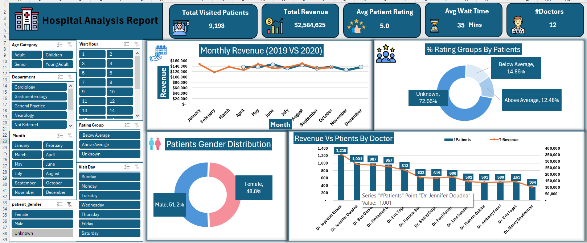
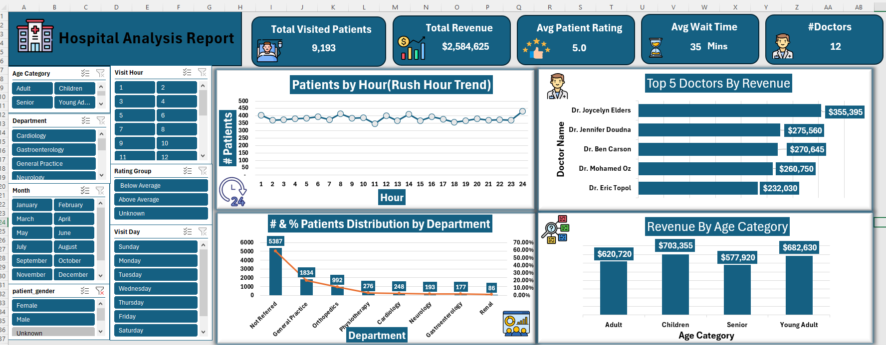
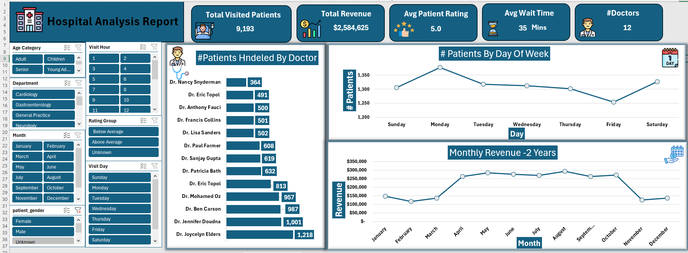
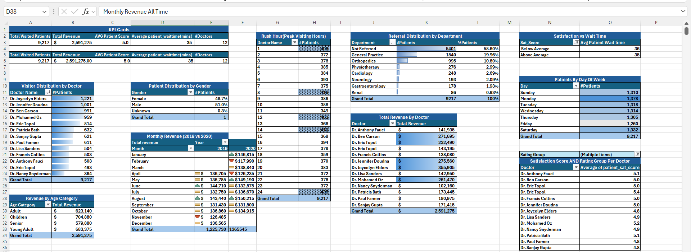
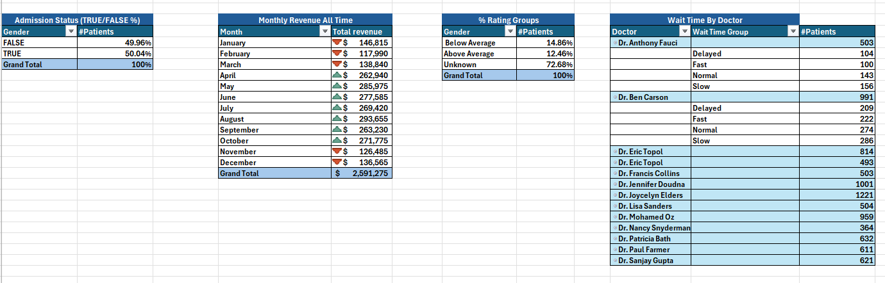

# 🏥 Hospital Performance Analysis  
### End-to-End Excel Data Cleaning, Transformation, Analysis & Dashboards

This project analyzes hospital operational and clinical performance using a complete end-to-end Excel workflow.  
It covers **data cleaning**, **transformation**, **feature engineering**, **pivot table analysis**, and **interactive dashboard creation** to help support decisions related to:

- Patient flow  
- Revenue management  
- Satisfaction monitoring  
- Doctor performance  
- Department referrals  
- Operational efficiency  
- Demographic trends  

The project uses **9,217 hospital visit records** spanning **2019–2020**.  
📄 *Full detailed documentation included in project file.* :contentReference[oaicite:1]{index=1}

---

## 📌 **Project Summary**

The goal of this project was to convert raw hospital visit data into a structured analytical model using Excel.  
The final deliverables include:

- Cleaned & transformed dataset  
- 20+ analytical PivotTables  
- 3 fully designed interactive dashboard pages  
- KPI cards, slicers, charts, and comparative analytics  
- Insights & recommendations for hospital management  

---

# 🔧 **1. Data Cleaning**

Performed a full cleaning pipeline to prepare raw data for analysis:

### ✔ Missing Values
- Gender → replaced with **"Unknown"**  
- Satisfaction Score → kept blank, later grouped as **"Not Rated"**

### ✔ Duplicates
- Checked using `patient_id`, date, and full name  
- Removed duplicate entries

### ✔ Data Type Fixes
Each column was standardized:

| Column | Data Type |
|--------|-----------|
| Date / Visit Time / Visit Hour | Date, Time, Integer |
| Patient Age | Number |
| Age Group / Rating Group | Text |
| Doctor | Text |
| Admin Flag | Boolean |
| Revenue | Currency |
| Department | Text |
| Satisfaction Score | Number |

---

# 🔄 **2. Data Transformation**

Several new engineered features were created to enable deeper analysis.

### 📆 **Datetime Components**
The combined datetime column was split into:
- Visit Date  
- Visit Time  
- Visit Hour (1–24)  
- Visit Day  
- Month  
- Year  

### 👶 **Age Grouping**
Created age bands:
- **0–20 → Children**  
- **21–40 → Young Adult**  
- **41–60 → Adult**  
- **61–80 → Senior**

### ⭐ **Satisfaction Grouping**
- 0–5 → Low Score  
- 6–10 → High Score  
- Missing → Not Rated  

### ⏳ **Wait Time Categories**
- Fast (10–20 mins)  
- Normal (21–35 mins)  
- Slow (36–50 mins)  
- Delayed (51–60 mins)

### 🧍 Full Name Creation
Combined first initial + last name into a readable **Full Name**.

---

# 📊 **3. Exploratory Analysis (Pivot Tables)**

More than **20 PivotTables** were created to explore:

- Patient volume  
- Revenue trends  
- Gender distribution  
- Age segmentation  
- Satisfaction scoring  
- Referral sources  
- Doctor performance  
- Wait time patterns  
- Visiting hour and weekday traffic  
- Revenue by age & revenue by doctor  
- YOY revenue comparison (2019 vs 2020)

Complete list of 22 analysis questions is included in the documentation. :contentReference[oaicite:2]{index=2}

---

# 📈 **4. Dashboards**

Three fully interactive dashboards were created to present insights visually.

---

## 🟦 **Dashboard Page 1 — KPI Overview & Operational Trends**
Includes:
- Total Patients  
- Total Revenue  
- Avg Satisfaction  
- Avg Wait Time  
- Number of Doctors  

Visuals:
- Patients by Hour (Rush Hour Trend)  
- Top 5 Doctors by Revenue  
- Patient Distribution by Department  
- Revenue by Age Category  

---

## 🟩 **Dashboard Page 2 — Financial, Referral & Demographic Insights**
Includes:
- Monthly Revenue (2019 vs 2020)  
- Rating Group Distribution (Donut)  
- Gender Distribution (Donut)  
- Referral Breakdown  

---

## 🟧 **Dashboard Page 3 — Weekly Behavior & Doctor Workload**
Includes:
- Patients Handled by Each Doctor  
- Patients by Day of Week  
- Monthly Revenue Trend (2 Years)

---

# 📌 **5. Key Insights**

### 🧑‍⚕️ **Doctor Performance**
- Dr. Joycelyn Elders handled the most patients: **1,218+**
- High workload concentration on top doctors → imbalance risks

### 👥 **Patient Demographics**
- Gender split almost equal (Male 51% / Female 48.7%)
- Strong engagement from Children & Young Adult categories

### 🕒 **Operational Insights**
- Peak hour = **Hour 24 (midnight)**  
- Monday = busiest day  
- Friday = slowest day  

### 💰 **Revenue Insights**
- Total revenue = **$2,591,275**  
- Revenue stable across months  
- High revenue from Children & Young Adults  

### ⭐ **Patient Satisfaction**
- Avg score = **5.0 / 10**  
- 72% "Not Rated" → low survey participation  

### 🏥 **Referral Insights**
- 58.6% patients are walk-ins  
- General Practice & Orthopedics are top referral sources  

---

# 📝 **6. Recommendations**

- Increase patient satisfaction survey engagement  
- Balance doctor workload  
- Add staffing on peak hours (Hour 8 & Hour 24)  
- Enhance referral relationships with strong-performing departments  
- Monitor slow and delayed wait time categories  

---

# 📦 **7. Final Deliverables**

- Cleaned dataset  
- Fully transformed analytic model  
- 20+ PivotTables  
- 3 interactive dashboards  
- Analysis report  
- LinkedIn-ready project summary

---

# 🙌 **8. Tools Used**
- Microsoft Excel  
  - Data Cleaning  
  - Data Transformation  
  - PivotTables  
  - PivotCharts  
  - Dashboard UI Design  

---

# 📁 **Project Documentation**
Full documentation (Cleaning, Transformation, KPIs, Pivot Setup, Dashboards, Insights):  
**Included in:** *HOSPITAL PERFORMANCE ANALYSIS Document.docx*  
:contentReference[oaicite:3]{index=3}

---

## 🎉 **Thank you for reviewing this project!**
Feel free to reach out for feedback, collaboration, or analytics discussions.

## 📊 Dashboard Page 1

## 📊 Dashboard Page 2

## 📊 Dashboard Page 3

## 📈 Pivot Tables – Summary

