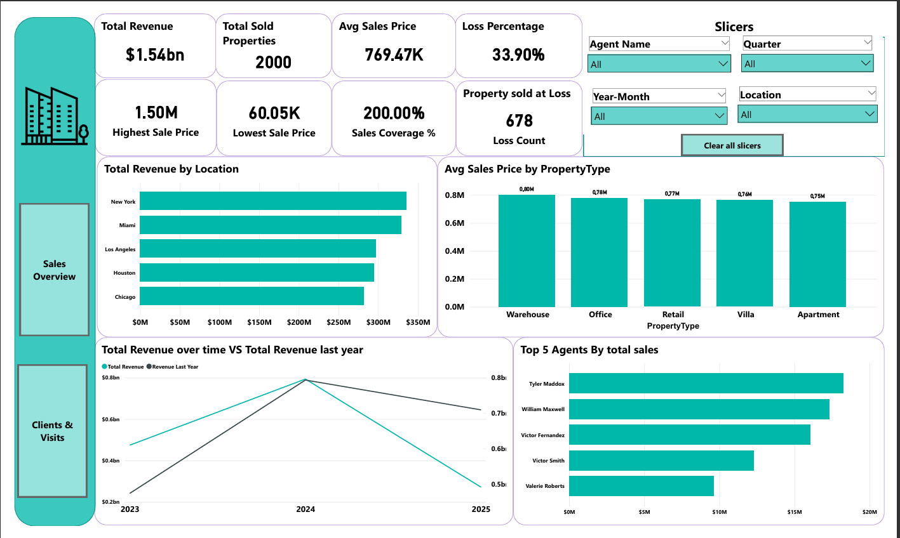

# 🏠 Real Estate Agency Dashboard  
**Power BI Project — Sales and Client Performance Analysis**

---

## 📘 Project Overview
This **Power BI dashboard** analyzes key performance metrics for a real estate agency, providing insights into **sales revenue, agent performance, property types, and client interactions**.

The dashboard is divided into **two pages**:
1. **Sales Overview** – focusing on revenue, property sales, and agent performance.
2. **Clients & Visits** – analyzing client interactions, visits, and conversion efficiency.

---

## 📂 Dataset Information

**File:** `Real Estate Agency.xlsx`  
**Source:** Simulated dataset representing property sales, client visits, and agent performance for the years **2023–2025**.

| Column | Description |
|---------|-------------|
| **Agent Name** | Name of the sales agent handling the property |
| **Client ID** | Unique client reference |
| **Property Type** | Warehouse, Office, Retail, Villa, Apartment |
| **Location** | City where the property is located (New York, Miami, Los Angeles, Houston, Chicago) |
| **Sale Price** | Property selling price |
| **Sale Date** | Date of the property sale |
| **Loss Flag** | Indicates if the property was sold at a loss |
| **Visits** | Number of visits made by a client |
| **Conversion Rate** | Conversion ratio per agent |
| **Quarter** | Financial quarter extracted from the sale date |
| **Year-Month** | Year and month extracted for time analysis |

---

## 🧹 Data Cleaning & Preparation
Performed in **Power Query (M Language)** within Power BI.

### 🔧 Cleaning Steps
1. **Removed blank and duplicate records** for property and agent names.  
2. **Standardized date formats** and extracted:
   - `Year`
   - `Quarter`
   - `Year-Month`
3. **Converted currency values** (Sale Price, Revenue) to numeric type.  
4. **Created conditional columns**:
   - `Loss Flag` → *True* if Sale Price < Average Price  
   - `Revenue Last Year` for time-series comparison
5. **Renamed columns** for clarity and consistency.  

### 🧱 Data Model
- **Fact Table:** `Sales` (transactions and prices)  
- **Dimension Tables:** `Agent`, `Property`, `Location`, `Date`

| Relationship | Type |
|---------------|------|
| Sales[Agent Name] → Agent[Agent Name] | Many-to-One |
| Sales[Property Type] → Property[Property Type] | Many-to-One |
| Sales[Location] → Location[City] | Many-to-One |
| Sales[Date] → Date[Date] | Many-to-One |

> The model uses a **Star Schema** for optimal query performance and clean visual relationships.

---

## 🧮 DAX Measures

| **Measure** | **Purpose / Formula** |
|--------------|-----------------------|
| **Total Revenue** | `Total Revenue = SUM(Sales[Sale Price])` |
| **Total Sold Properties** | `Total Properties = COUNT(Sales[Property ID])` |
| **Average Sales Price** | `Avg Sales Price = AVERAGE(Sales[Sale Price])` |
| **Loss Percentage** | `Loss % = DIVIDE(COUNTROWS(FILTER(Sales, Sales[Loss Flag] = TRUE())), [Total Sold Properties])` |
| **Highest Sale Price** | `Highest Sale = MAX(Sales[Sale Price])` |
| **Lowest Sale Price** | `Lowest Sale = MIN(Sales[Sale Price])` |
| **Sales Coverage %** | `Sales Coverage % = ([Highest Sale Price] / [Lowest Sale Price]) * 100` |
| **Loss Count** | `Loss Count = COUNTROWS(FILTER(Sales, Sales[Loss Flag] = TRUE()))` |
| **Total Revenue Last Year** | `Revenue LY = CALCULATE([Total Revenue], SAMEPERIODLASTYEAR('Date'[Date]))` |
| **Median Sales Price** | `Median Price = MEDIAN(Sales[Sale Price])` |
| **Average Visits per Client** | `Avg Visits per Client = DIVIDE(SUM(Sales[Visits]), DISTINCTCOUNT(Sales[Client ID]))` |
| **Agent Conversion Rate** | `Conversion Rate = DIVIDE(SUM(Sales[Conversions]), SUM(Sales[Visits]))` |
| **#Sold Properties by PropertyType** | `Sold Count = COUNT(Sales[Property ID])` |

---

## 📊 Dashboard 1 — *Sales Overview*

### 🔹 KPIs
| KPI | Value |
|------|-------|
| **Total Revenue** | $1.54B |
| **Total Sold Properties** | 2000 |
| **Average Sales Price** | $769.47K |
| **Loss Percentage** | 33.9% |
| **Highest Sale Price** | $1.50M |
| **Lowest Sale Price** | $60.05K |
| **Property Sold at Loss** | 678 |
| **Sales Coverage %** | 200% |

---

### 📍 Visuals & Insights

#### **1. Total Revenue by Location**
- **New York** and **Miami** generated the highest revenue.
- Consistent performance across all major U.S. markets.

#### **2. Avg Sales Price by Property Type**
| Property Type | Avg Sales Price |
|----------------|------------------|
| Warehouse | 0.80M |
| Office | 0.78M |
| Retail | 0.77M |
| Villa | 0.76M |
| Apartment | 0.75M |

> Warehouse and Office properties achieve the highest sale prices on average.

#### **3. Total Revenue Over Time vs Last Year**
- 2024 saw a **peak of $0.8B**, followed by a decline in 2025.
- Indicates potential seasonal slowdown or market correction.

#### **4. Top 5 Agents by Total Sales**
| Agent | Total Sales |
|--------|--------------|
| Tyler Maddox | $19M |
| William Maxwell | $17M |
| Victor Fernandez | $16M |
| Victor Smith | $13M |
| Valerie Roberts | $11M |

> Tyler Maddox is the **top-performing agent**, driving the largest revenue share.

---

## 📈 Dashboard 2 — *Clients & Visits*

### 🔹 KPIs
| KPI | Value |
|------|-------|
| **Avg Visits per Client** | 3.33 |
| **Total Agents** | 100 |
| **Total Visits** | 5000 |
| **Total Clients** | 1500 |
| **Median Sales Price** | $745.31K |

---

### 📍 Visuals & Insights

#### **1. Total Agent Visits Over Time**
- Agent visits gradually declined from **445 (Dec 2024)** to **137 (May 2025)**.
- Suggests seasonal trends or reduced property listings.

#### **2. Agent Conversion Rate by Agent Name**
| Agent | Conversion Rate |
|--------|------------------|
| Tyler Maddox | 0.67 |
| Taylor Clark | 0.53 |
| Tammy Walker | 0.52 |
| William Maxwell | 0.51 |
| Tammy Cohen | 0.45 |

> Tyler Maddox leads again, with the **highest client conversion efficiency**.

#### **3. #Sold Properties by Property Type**
| Property Type | Sold Units |
|----------------|-------------|
| Apartment | 500 |
| Villa | 428 |
| Retail | 377 |
| Office | 355 |
| Warehouse | 340 |

> **Apartments and Villas** dominate total sold properties, showing strong demand.

---

## 🧩 Slicers & Interactivity
Slicers available across both pages:
- **Agent Name**
- **Quarter**
- **Year-Month**
- **Location**

All slicers are cross-page synchronized using Power BI **“Sync Slicers”** feature.  
Each dashboard includes a **“Clear All Slicers”** button for user convenience.

---

## 🧠 Business Insights Summary
1. **$1.54B total revenue** achieved across five major U.S. cities.  
2. **2000 properties sold**, averaging **$769K** each.  
3. **33.9% of sales** were at a loss — an area for profitability review.  
4. **Warehouse** and **Office** properties yield the highest average sale prices.  
5. **Tyler Maddox** consistently tops both revenue and conversion rate charts.  
6. **Client engagement** decreased in 2025; focus on reactivation is needed.  
7. **Apartments (500 units)** represent the highest volume sales category.  
8. The **median price ($745K)** aligns closely with the market average.  
9. Strong **sales coverage ratio (200%)** suggests pricing diversity across regions.  
10. Agent efficiency (avg. 3.33 visits per client) indicates an active and competitive market.

---

## ⚙️ Tools & Techniques Used
| Tool | Purpose |
|------|----------|
| **Microsoft Power BI Desktop** | Data modeling and dashboard creation |
| **Power Query** | Data cleaning and transformation |
| **DAX (Data Analysis Expressions)** | KPIs and calculated metrics |
| **Excel** | Data source and validation |
| **Slicers & Bookmarks** | Interactive filtering and navigation |
| **Cards, Bar, Line, Pie Charts** | Visual storytelling |

---

## 📁 Project Files

| File | Description |
|------|--------------|
| `Real-Estate Dashboard.pbix` | Main Power BI report |
| `Real Estate Agency.xlsx` | Data source (property, client, and agent details) |
| `Sales Overview.png` | Dashboard page 1 – Sales Overview |
| `Clients&Visits.png` | Dashboard page 2 – Clients & Visits |
| `PBI Task 2 (summer data camp).pdf` | Presentation of insights and visuals |

---

## 🏁 Conclusion
This **Real Estate Power BI Dashboard** effectively visualizes key insights into sales performance, agent productivity, and client engagement.  
It empowers management to:
- Track high-value markets and agents  
- Understand profitability distribution  
- Evaluate client conversion efficiency  

> The dashboard integrates both financial and operational KPIs, providing a **complete 360° view of agency performance**.

---

© 2025 – Real Estate Analytics Dashboard | Developed in Microsoft Power BI
