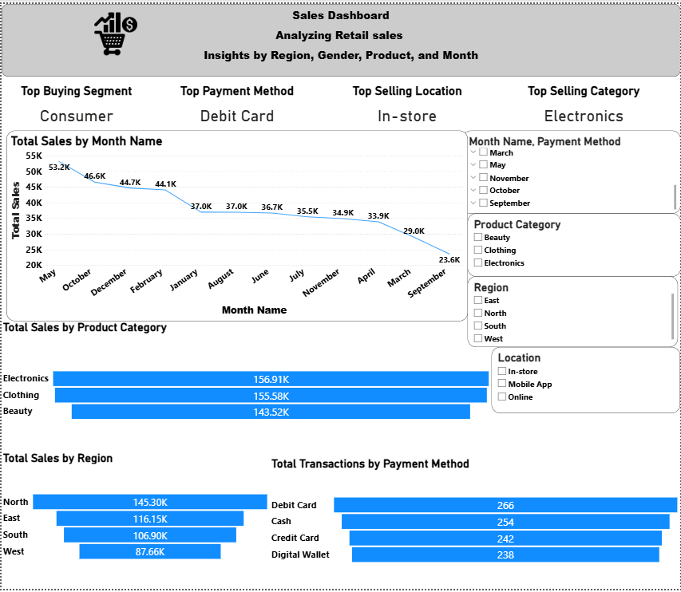

# 🛒 Retail Sales BI Project  
**Analyzing Retail Sales by Region, Gender, Product, and Month**

---

## 📘 Project Overview
This Business Intelligence project analyzes retail transactions from a large dataset of **900K+ records**, focusing on customer behavior, sales trends, and performance insights across **region, gender, product category, location, and payment methods**.  

It aims to provide stakeholders with clear, visual insights into:
- Which customer segments and genders drive the most sales  
- Which product categories and regions perform best  
- Monthly sales trends and preferred payment methods  
- How sales differ by location type (In-store, Online, Mobile App)

---

## 📂 Dataset Information

**File:** `retail_sales_dataset_900k_with_columns.xlsx`  
**Rows:** 900,000+  
**Columns:** 14  

| Column Name | Description |
|--------------|-------------|
| Transaction_ID | Unique identifier for each transaction |
| Date | Date of purchase |
| Month_Name | Month extracted from the date |
| Customer_ID | Unique customer reference |
| Gender | Male / Female |
| Customer_Segment | Consumer / Corporate / Home Office |
| Region | North / East / South / West |
| Location | In-store / Online / Mobile App |
| Product_Category | Beauty / Clothing / Electronics |
| Quantity | Units purchased |
| Unit_Price | Price per unit |
| Payment_Method | Cash / Credit Card / Debit Card / Digital Wallet |
| Total_Sales | Computed as Quantity × Unit Price |
| Profit | Optional field for margin analysis |

---

## 🧮 Data Preparation
Data cleaning and transformations were performed in Power Query before loading to the model:

- **Removed nulls and duplicates** from `Transaction_ID` and `Customer_ID`
- **Created calculated columns:**
  - `Total_Sales = Quantity * Unit_Price`
  - `Month_Name` (derived from `Date`)
- **Standardized categorical values** (Gender, Region, Location)
- **Created Date Hierarchy:** Year → Quarter → Month
- **Aggregated tables** for total sales by region, category, and payment method

---

## 🧠 Data Model (Power BI)

| Table | Related To | Key | Relationship Type |
|--------|-------------|-----|------------------|
| Fact_Sales | Dim_Customer | Customer_ID | Many-to-One |
| Fact_Sales | Dim_Date | Date | Many-to-One |
| Fact_Sales | Dim_Product | Product_Category | Many-to-One |

> **Model Type:** Star Schema  
> **Storage Mode:** Import  
> **Primary Fact Table:** `Fact_Sales`

---

## 📊 Dashboard 1 — *Sales Overview & Demographics*


### Key Metrics
| KPI | Value |
|------|-------|
| **Total Transactions** | 1000 |
| **Total Sales** | 456K |
| **Top Buying Gender** | Female |
| **Top Consumption Region** | North |

---

### 👥 Customer Insights
- **Top Buying Segment:** Consumer  
- **Female customers** dominate in both sales quantity and total sales value  
- **Corporate** and **Home Office** segments contribute moderately

| Customer Segment | Gender | Total Quantity | Total Sales |
|------------------|---------|----------------|--------------|
| Consumer | Male | 751 | 132,610 |
| Consumer | Female | 738 | 132,245 |
| Corporate | Male | 130 | 67,520 |
| Corporate | Female | 116 | 54,380 |
| Home Office | Male | 75 | 36,170 |
| Home Office | Female | 90 | 33,075 |

---

### 🏪 Location Performance
| Location | Total Sales | % of Transactions |
|-----------|-------------|-------------------|
| In-store | 150K+ | 35.4% |
| Online | 140K+ | 33.7% |
| Mobile App | 130K+ | 30.9% |

**Visuals:**
- **Bar chart:** Total Sales by Location  
- **Donut chart:** Total Transactions by Location  
- **Donut chart:** Sales by Gender & Product Category  

---

### 💄 Product Insights
| Product Category | Female Sales | Male Sales | Total |
|------------------|--------------|-------------|--------|
| Beauty | 510 | 490 | 1000 |
| Clothing | 510 | 490 | 1000 |
| Electronics | 510 | 490 | 1000 |

> Beauty and Clothing are equally popular among both genders, while Electronics slightly leads in total revenue.

---

## 📈 Dashboard 2 — *Sales by Month, Region, and Payment Method*



### Key Metrics
| KPI | Value |
|------|-------|
| **Top Buying Segment** | Consumer |
| **Top Payment Method** | Debit Card |
| **Top Selling Location** | In-store |
| **Top Selling Category** | Electronics |

---

### 📅 Monthly Sales Trend
| Month | Total Sales |
|--------|--------------|
| May | 53.2K |
| October | 46.6K |
| December | 44.7K |
| February | 44.1K |
| January | 37.0K |
| August | 37.0K |
| June | 36.7K |
| July | 35.5K |
| November | 34.9K |
| April | 33.9K |
| March | 29.0K |
| September | 23.6K |

> Peak sales occur in **May**, with gradual declines toward **September**.

---

### 🧴 Sales by Product Category
| Product Category | Total Sales |
|------------------|-------------|
| Electronics | 156.91K |
| Clothing | 155.58K |
| Beauty | 143.52K |

---

### 🌍 Sales by Region
| Region | Total Sales |
|---------|-------------|
| North | 145.30K |
| East | 116.15K |
| South | 106.90K |
| West | 87.66K |

> The **North Region** leads in total sales, contributing the highest share to overall revenue.

---

### 💳 Transactions by Payment Method
| Payment Method | Transactions |
|----------------|---------------|
| Debit Card | 266 |
| Cash | 254 |
| Credit Card | 242 |
| Digital Wallet | 238 |

> **Debit Cards** are the most preferred payment method among customers.

---

## ⚙️ Tools & Technologies
| Tool | Purpose |
|------|----------|
| **Power BI Desktop (.pbix)** | Data modeling, visual creation, DAX measures |
| **Power Query** | Data transformation and cleaning |
| **Excel (.xlsx)** | Raw dataset storage |
| **DAX** | Measures for KPIs and calculated fields |
| **Canva / Power BI Service** | Dashboard presentation and sharing |

---

## 🧮 DAX Measures

| **Measure** | **Purpose** |
|--------------|-------------|
| **Total Sales** | Sum of sales amount |
| **Total Quantity** | Sum of quantity sold |
| **Total Transactions** | Count of all transactions |
| **Top Selling Category** | Identify the category with highest total sales |
| **Top Buying Segment** | Identify the top customer segment |
| **Top Payment Method** | Identify the most used payment method |
| **Top Selling Location** | Identify where most sales happen (In-store, Online) |
| **Sales by Gender** | Analyze number of transactions by Male/Female |
| **Count of Male and Female Customers** | Count unique customers by gender |
| **Top Consumption Region** | Identify the region with the highest sales |
| **Top Buying Gender** | Find which gender contributes more in purchases |
| **Sales Growth by Month** | Analyze sales performance month-over-month |

---

## 📊 Key DAX Code Examples

```DAX
Total Sales = SUM(Fact_Sales[Total_Sales])

Total Transactions = COUNT(Fact_Sales[Transaction_ID])

Top Buying Gender = 
VAR GenderSales = 
    SUMMARIZE(Fact_Sales, Fact_Sales[Gender], "Sales", SUM(Fact_Sales[Total_Sales]))
RETURN
    TOPN(1, GenderSales, [Sales], DESC)

Top Region = 
VAR RegionSales = 
    SUMMARIZE(Fact_Sales, Fact_Sales[Region], "Sales", SUM(Fact_Sales[Total_Sales]))
RETURN
    TOPN(1, RegionSales, [Sales], DESC)
