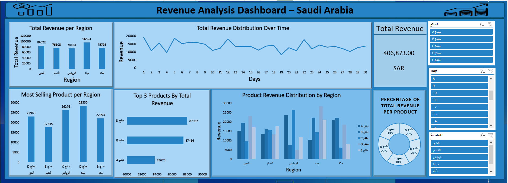

# 📊 Revenue Analysis Dashboard – Saudi Arabia (Excel Project)

**Analyzing regional and product-based revenue trends using Pivot Tables and Charts**

---

## 📘 Project Overview
This project presents a **Revenue Analysis Dashboard** for **Saudi Arabia**, built entirely in **Microsoft Excel** using **Pivot Tables, Pivot Charts, and interactive slicers**.  

The dashboard provides visual insights into:
- Total revenue by **region** and **product**
- Revenue trends over **time (days)**
- Best-selling products across locations
- Product contribution percentages to total revenue

---

## 📂 Dataset Information

**File:** `Dataset_مسابقة_محللي_البيانات.xlsx`  
**Source:** Competition Dataset — Raw daily sales for multiple Saudi regions  
**Currency:** SAR (Saudi Riyal)  

| Column Name | Description |
|--------------|-------------|
| **Day** | Day of transaction (1–30) |
| **Region (المنطقة)** | Sales location (e.g., الخبر, الدمام, الرياض, جدة, مكة) |
| **Product (المنتج)** | Product name/category (منتج A, B, C, D, E) |
| **Revenue (الإيراد)** | Total daily sales in SAR |
| **Quantity (الكمية)** | Units sold per product per day |

---

## 🧮 Data Preparation (Excel)
Before creating the dashboard, several cleaning and setup steps were done directly in Excel:

1. **Data Cleaning**
   - Removed blank rows and duplicate entries.
   - Verified consistent Arabic naming for regions and products.
   - Ensured numeric formatting for the `Revenue` and `Quantity` columns.
   - Converted the range into an **Excel Table** (`Ctrl + T`) for dynamic referencing.

2. **Data Organization**
   - Added new calculated columns:
     - **Total Revenue** = `=Quantity * UnitPrice` (if applicable)
     - **Day Name** = `=TEXT([@Day],"0")` (for easier filtering)
   - Verified chronological sorting of days (1 → 30).

3. **Pivot Table Setup**
   - Inserted multiple Pivot Tables for different KPIs.
   - Each Pivot Table was placed in a structured dashboard layout.

---

## 📊 Dashboard Overview  

The Excel dashboard combines six main Pivot Charts and multiple slicers for interactivity.

---

## 🧱 Dashboard Components

### 1. **Total Revenue per Region**
- **Chart Type:** Clustered Column Chart  
- **Pivot Table Fields:**
  - *Rows:* Region  
  - *Values:* Sum of Revenue  
- **Insight:**  
  - جدة (Jeddah) has the **highest total revenue** (96,524 SAR).  
  - Followed by الخبر (84,022 SAR) and الدمام (76,108 SAR).  

| Region | Total Revenue (SAR) |
|---------|----------------------|
| جدة | 96,524 |
| الخبر | 84,022 |
| الدمام | 76,108 |
| الرياض | 74,424 |
| مكة | 75,795 |

---

### 2. **Total Revenue Distribution Over Time**
- **Chart Type:** Line Chart  
- **Pivot Fields:**
  - *Axis:* Day  
  - *Values:* Sum of Revenue  
- **Insight:** Revenue fluctuates through the month, peaking around **Days 6–10** and **Days 20–23**.  

---

### 3. **Most Selling Product per Region**
- **Chart Type:** Clustered Column Chart  
- **Pivot Setup:**  
  - *Rows:* Region  
  - *Columns:* Product  
  - *Values:* Sum of Revenue  
- Highlighted each region’s **top-selling product** using conditional formatting and color emphasis.  

| Region | Top Product | Revenue (SAR) |
|---------|-------------|---------------|
| الخبر | منتج D | 22,963 |
| الدمام | منتج E | 17,645 |
| الرياض | منتج C | 26,276 |
| جدة | منتج D | 28,330 |
| مكة | منتج B | 22,093 |

---

### 4. **Top 3 Products by Total Revenue**
- **Chart Type:** Horizontal Bar Chart  
- **Pivot Fields:**
  - *Rows:* Product  
  - *Values:* Sum of Revenue  
- **Sorting:** Descending order by total revenue.  

| Product | Total Revenue (SAR) |
|----------|----------------------|
| منتج D | 87,987 |
| منتج B | 87,466 |
| منتج A | 83,670 |

> The top 3 products contribute over 60% of total sales.

---

### 5. **Product Revenue Distribution by Region**
- **Chart Type:** Clustered Column Chart  
- **Pivot Fields:**
  - *Axis:* Region  
  - *Legend:* Product  
  - *Values:* Sum of Revenue  
- Used different shades of blue to distinguish product performance per region.

---

### 6. **Percentage of Total Revenue per Product**
- **Chart Type:** Pie Chart  
- **Pivot Table:** Calculated % of total revenue per product using "Show Values As → % of Grand Total".  

| Product | % of Total Revenue |
|----------|--------------------|
| منتج D | 22% |
| منتج B | 21% |
| منتج A | 20% |
| منتج E | 19% |
| منتج C | 18% |

> **منتج D (Product D)** is the top contributor with 22% of total sales.

---

## 🧩 Slicers and Interactivity
Interactive **Pivot Table Slicers** were added for:
- **المنتج (Product)** – Filters all charts by product type  
- **اليوم (Day)** – Enables viewing daily trends  
- **المنطقة (Region)** – Allows multi-region comparisons  

All slicers are **connected to multiple Pivot Tables** via “Report Connections,” ensuring full dashboard interactivity.

---

## ⚙️ Tools & Techniques Used

| Tool | Purpose |
|------|----------|
| **Microsoft Excel** | Main platform for analysis |
| **Pivot Tables & Charts** | Data summarization and visualization |
| **Slicers** | Interactive filtering |
| **Conditional Formatting** | Highlighting top products |
| **Data Table (Ctrl + T)** | Dynamic data range |
| **Custom Cell Formatting (Arabic)** | Localization and professional presentation |

---

## 💡 Key Insights
- **Jeddah (جدة)** leads all regions in total revenue.  
- **Product D (منتج D)** is the most profitable product overall.  
- **Revenue peaks mid-month** around Days 6–10 and 20–23.  
- **Regional preferences differ:** Product C dominates Riyadh, Product B performs best in Makkah.  
- Dashboard layout allows **quick, language-friendly exploration** of data in Arabic.

---

## 📁 Project Files

| File Name | Description |
|------------|-------------|
| `Dataset_مسابقة_محللي_البيانات.xlsx` | Original dataset with all sales records |
| `final Dashboard.png` | Screenshot of the Excel dashboard |
| `Revenue_Analysis_Dashboard_Saudi_Arabia_Excel.xlsx` | The final Excel dashboard with Pivot Tables and slicers |

---

## 🏁 Conclusion
This Excel-based **Revenue Analysis Dashboard** effectively demonstrates how powerful **Pivot Tables and Charts** can be for data analytics and storytelling.  
It highlights:
- Key **revenue trends across Saudi regions**
- **Top products driving sales**
- **Visual, interactive insights** built entirely within Excel — no Power BI or DAX required.

> The dashboard serves as a **lightweight, accessible tool** for business analysts and management teams who prefer Excel-based visualization and localized Arabic reporting.

---
